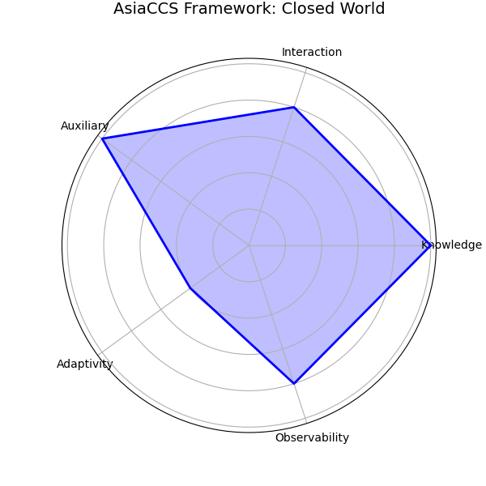
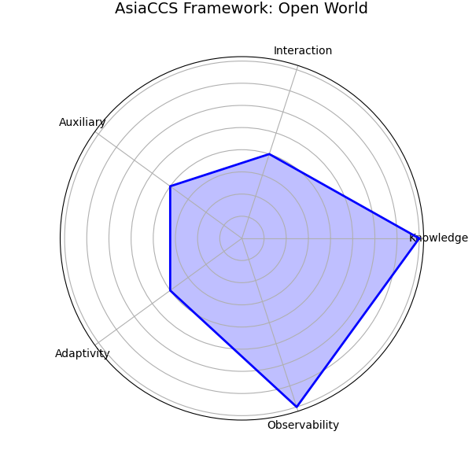

# Reproducibility Package: Privacy Evaluation Framework
**Submission for AsiaCCS 2026**

This repository contains the source code, dataset, and reproduction scripts for the poster: **"A Structured Framework for the Reproducible Evaluation of Privacy and Anonymity."**

## 1. The Framework
Our framework explicitly models privacy evaluations across five dimensions to prevent "apples-to-oranges" comparisons.


## 2. Reproduction Results (Case Study)
We apply this framework to reproduce the "Open World vs. Closed World" discrepancy in Website Fingerprinting attacks.

| Closed World (High Priors) | Open World (Realistic) |
| :---: | :---: |
|  |  |
| *Artificial 90%+ Accuracy* | *Realistic <3% Accuracy* |

## 3. Usage
To regenerate these plots from the raw dataset:
```bash
python3 scripts/radar_gen.py
```

## 4. Full Submission
The complete anonymous poster abstract is available here:
[📄 Download Blinded Submission (PDF)](submission_blinded.pdf)
